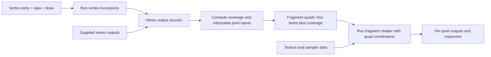

# Plan: Fragment Shaders with Interpolated Pixel Inputs and 2×2 Quads

Status: design proposal, 2026-10-04. Implementation has not started. Configuration
examples below are proposed, not currently supported.

Run the vertex shader, collect its outputs, compute interpolated inputs for each
pixel, and execute the fragment shader in groups of four neighboring pixels. Use
a straightforward CPU implementation and the existing interpreter. Model the
behavior needed to debug shader results without reproducing GPU internals.

Support two ways to supply fragment inputs from the beginning:

- **From vertices:** the user specifies vertex and fragment entry points, vertex
  data, a draw, and a viewport. Compute pixel inputs from the resulting triangles.
- **Supplied vertex outputs:** the user supplies clip positions and location
  values for the vertices of triangles, plus a viewport, with no vertex shader.

Both paths feed the same coverage, interpolation, and quad-generation code. Users
provide vertex data; pixel inputs, quad origins, lanes, and helper coverage are
computed internally.

## What already works

| Existing capability | Location | Work still needed |
| --- | --- | --- |
| Vertex/instance invocations from a non-indexed draw | `malkovri_wgsl_debugger/src/debugger/config.rs` | Supply attributes at `@location(N)`. |
| Entry-point return capture | `malkovri_wgsl_debugger/src/invocation/step.rs` | Reuse it for vertex and fragment outputs. |
| Per-thread Shader Outputs inspection | `malkovri_wgsl_debugger/src/debugger/outputs.rs` and DAP | Expose binding metadata for interpolation, beyond display names. |
| Basic fragment entry execution | `ExecutionConfig::Fragment` | Configurable inputs and multiple pixel invocations. |
| Stage/name entry selection | `malkovri_wgsl_debugger_dap/src/parse_input.rs` | Select both entries for a vertex-driven run. |
| Invocation scheduling and collective result injection | `malkovri_wgsl_debugger/src/debugger/` | Add quad coordination for expressions. |
| Naga validation, including uniformity | `malkovri_wgsl_debugger/src/program/parse.rs` | Preserve checks and report unsupported runtime cases clearly. |

`@location` arguments currently evaluate to `Value::Uninitialized`. Input structs
also need their members assembled from bindings. Derivative and texture expressions
are not implemented. `discard` currently behaves as a return from the current
function, which is insufficient for fragments and helper lanes.

## Data flow and small core types



Reuse `ShaderProgram` and `Debugger`; each debugger executes one stage. A small
coordinator runs vertex execution, input generation, and fragment execution in
sequence. Input generation is ordinary CPU code, not a debuggable shader stage.

The core only needs records for:

- `VertexOutput`: vertex/instance identity, clip position, and location values.
- `FragmentInput`: framebuffer position, front-facing/sample builtins, and
  location values.
- `FragmentQuad`: primitive/instance identity, even pixel origin, four inputs,
  and a four-bit coverage mask.
- Fragment results: pixel/primitive identity, returned location/builtin outputs,
  and whether the lane is uncovered or discarded.

Keep these records independent of launch JSON. Add structured binding/type metadata
to output inspection or a core extraction helper; never parse `"@location(0)"`
from display labels. Use the same reflected interface mapping for direct arguments,
struct arguments, direct returns, and struct returns.

Initialize resource bindings once for a linked run and share resource storage
across its stages. Keep private globals and frames per invocation. Completed
vertex outputs are retained as snapshots. Independent debugger sessions remain
isolated; creating a fresh session from the original launch values must not
silently reset resource writes during a linked run.

## 1. Run vertices and collect usable outputs

Keep `DrawConfig` and its vertex/instance indexing. Add decoded attribute arrays
keyed by shader location. Each array has `stepMode: "vertex"` or `"instance"` and
exactly `vertexCount` or `instanceCount` values respectively. Array indexing is
relative to `firstVertex`/`firstInstance`; builtin indices retain their absolute
values. This keeps user-provided data small even when debugging nonzero indices.

Infer scalar/vector types from WGSL and validate data before execution. Initially
support `f32`, `i32`, `u32`, and vectors of 2–4 elements. Reject missing locations,
wrong shapes/types, overflow, non-finite data, and unsupported types. Attribute
arrays are decoded values; binary vertex formats and strides can come later.

Collect every invocation's clip position and varyings after completion. Match
vertex outputs to fragment inputs by location, exact type, and compatible
interpolation metadata. Names and struct member order do not matter. Extra vertex
outputs can remain unused. Missing inputs or incompatible interfaces fail before
the vertex stage runs.

## 2. Compute inputs at pixels

Start with non-indexed triangle lists. Within each instance, consecutive groups
of three vertex outputs form triangles; require a multiple-of-three vertex count
for this mode. Preserve the current ability to run a single vertex independently.

For each triangle:

1. Divide clip XYZ by W, then map to a viewport of width `Wv` and height `Hv`:
   `x = (ndc.x + 1) * Wv / 2`, `y = (1 - ndc.y) * Hv / 2`.
2. Clamp the triangle's screen bounding box to the viewport. Test pixel centers
   `(x + 0.5, y + 0.5)` using edge functions and a deterministic top-left rule.
   Skip zero-area triangles. Derive `frontFacing` from the configured winding,
   accounting for the Y flip; default to CCW front faces and no culling.
3. Compute screen-space barycentric weights `lambda_i`. For each fragment
   location, interpolate according to its metadata:
   - Perspective: `sum(lambda_i * value_i / w_i) / sum(lambda_i / w_i)`.
   - Linear: `sum(lambda_i * value_i)`.
   - Flat: use the original primitive's first vertex; choose first consistently
     for a supported `either` qualifier too. Winding normalization must preserve
     this identity.
4. Set fragment position to pixel-center XY, interpolated `z_i / w_i` in the
   default depth range `[0, 1]`, and `sum(lambda_i / w_i)` as its W component.
   Set sample index to 0 and coverage mask to 1 for covered lanes.
5. Group pixels into aligned 2×2 quads and compute all four lane inputs as below.

Use a small viewport by default. An optional `focusPixel` selects its complete
quad for debugging; omitting it runs all covered quads. The focus never removes
neighbor lanes. No coverage at the selected pixel produces a clear no-fragment
result. Without a focus, no covered triangles completes with zero fragments.

Triangles that overlap a pixel produce distinct fragment invocations, identified
by instance, primitive, and pixel. Do not silently merge them. This first version
returns shader outputs rather than compositing an image with depth or blending.

Start with single-sample center interpolation and flat inputs. Support triangles
with finite coordinates, positive clip W, and all vertex depths inside `[0, W]`;
report unsupported near/far clipping instead of producing incorrect inputs.
Screen-space bounding-box clamping handles triangles extending beyond viewport XY.
Reject zero/non-finite interpolation denominators. Full clipping, MSAA, and other
interpolation sampling modes are later additions.

Vertex and fragment `position` have different meanings; their conversion follows
the [WGSL position definition](https://www.w3.org/TR/WGSL/#position-builtin-value).
Interpolation qualifiers follow [WGSL interpolation](https://www.w3.org/TR/WGSL/#interpolation).
Coverage and the viewport transform should be tested against [WebGPU rasterization](https://www.w3.org/TR/webgpu/#rasterization).

## 3. Use four lanes for every fragment quad

Use a fixed lane order with an even framebuffer origin `(x, y)`:

```text
lane 0: (x,   y)      lane 1: (x+1, y)
lane 2: (x,   y+1)    lane 3: (x+1, y+1)
```

Create a quad if any lane is covered. Uncovered lanes, including lanes beyond an
odd-sized viewport boundary, execute as helpers. Compute their inputs from the
same triangle's interpolation planes, even outside its coverage; do not copy the
nearest covered value. Keep quads separate per primitive so adjacent triangles
cannot exchange derivative operands.

Track coverage and helper/discard state separately from whether a thread is
running. Helpers execute shader calculations and contribute to quad operations,
but do not commit outputs or writes to externally visible resource memory.
Private/local writes still work. A covered lane executing `discard`, including
inside a called function, becomes a helper for the remainder of execution. Earlier
observable writes remain; later ones are suppressed. Do not terminate that lane
while a neighbor can still need it.

This matches the required role of [fragment helper invocations](https://www.w3.org/TR/WGSL/#fragment-shaders-and-helper-invocations)
and [discard](https://www.w3.org/TR/WGSL/#discard-statement), without emulating
hardware scheduling.

## 4. Coordinate derivatives and implicit texture sampling

Keep independent CPU interpreter state per lane and advance lanes sequentially.
At a derivative or implicit-LOD sampling expression, park each lane, collect all
four operands for the same dynamic operation, compute results, cache them in each
lane, and resume. Ordinary arithmetic and control flow remain per invocation.

This extends the existing collective scheduling idea, but these operations occur
inside Naga expression `Emit` ranges. Make emits resumable at an individual
expression: evaluate preceding expressions once, park before the collective, and
resume dependent expressions after injecting results. Inspection must only read
cached results and must not run neighbors or sample textures again.

Match rendezvous by expression site and dynamic call/loop instance, not source
line or expression handle alone. Different calls or iterations must never exchange
operands. Allow lanes to reconverge after ordinary divergent branches. If a lane
has returned or reached an incompatible collective, report a useful divergence
error; do not hang or substitute zero derivatives. Keep execution budget pauses
resumable, including halfway through a quad rendezvous.

For lane operand values `v0, v1, v2, v3`, use these deterministic choices:

| Operation | Result per lane |
| --- | --- |
| `dpdxFine` | `[v1-v0, v1-v0, v3-v2, v3-v2]` |
| `dpdyFine` | `[v2-v0, v3-v1, v2-v0, v3-v1]` |
| `dpdxCoarse` / `dpdyCoarse` | Use `v1-v0` / `v2-v0` for every lane. |
| Unqualified `dpdx` / `dpdy` | Use the fine choice. |
| `fwidth` variants | Sum absolute X and Y derivatives of the corresponding variant. |

Apply these componentwise to supported float values. Derive the expression's
actual operand values across lanes, including computations inside the shader;
precomputed input gradients alone are insufficient.

Keep Naga's existing uniformity validation enabled. Uniformity constraints apply
to operations such as derivatives and implicit-LOD sampling, not every `if` in a
fragment shader. Surface validation diagnostics. If diagnostics are disabled by
the shader and a collective cannot rendezvous, fail explicitly at runtime. We do
not promise useful derivatives from nonuniform collective execution. See
[WGSL derivatives](https://www.w3.org/TR/WGSL/#derivatives).

Quads provide the operand differences; texture sampling additionally needs texture
and sampler resources plus a CPU sampler. Plan that as a separate implementation
slice, not an automatic consequence of having four lanes:

- Start with 2D float RGBA texel data and explicit mip levels, plus nearest/linear
  filtering and clamp/repeat address modes. Keep existing buffer binding syntax;
  add tagged texture/sampler binding forms with identical native/WASM decoding.
- Implement explicit-level sampling first, then implicit sampling using quad UV
  differences scaled by texture dimensions. Choose LOD from the maximum gradient
  length, handle a zero gradient as the finest level, and apply sampler LOD clamps
  and mip filtering. Explicit-gradient sampling can reuse the same sampler.
- Use tiny known textures and distinct mip colors to verify coordinates, filtering,
  addressing, and derivative-driven LOD. Reject unsupported dimensions/formats and
  operations explicitly. No claim of bit-for-bit hardware filtering or anisotropy.

Full fragment subgroups and additional quad builtins can follow independently;
a quad must not be treated as an arbitrary compute workgroup or subgroup.

## 5. Supply vertex outputs without running a vertex shader

Accept an array of vertex-output records. Each record contains `position`, the
four-component clip-space output normally returned as `@builtin(position)`, and
`locations`, the user-defined outputs keyed by location. Consecutive groups of
three records form triangles. Require a nonempty multiple of three records and
a viewport; `focusPixel` is optional, just as in the vertex-execution path.

No vertex entry or draw configuration is needed. The first version treats the
records as one instance, assigning vertex and primitive identities from array
order. Infer each location's type and interpolation qualifiers from the selected
fragment entry. Validate every record against that interface: require all declared
locations, reject unknown locations and wrong types/shapes, and apply the same
clip-position restrictions as generated vertex outputs. No vertex interface is
available or needed in this mode.

Pass these records through the same triangle coverage and interpolation functions
used after vertex execution. Compute framebuffer positions, depth, reciprocal W,
front-facing, sample coverage, neighboring values, and helper lanes internally.
The launch schema exposes no lane records, quad origins, or per-lane overrides.
Constant varyings can be supplied by giving each triangle vertex the same value.

The user selects pixels for inspection, while the debugger generates and executes
their neighboring lanes as needed. Supplied records identical to a vertex shader's
outputs must produce identical pixel inputs, coverage, derivatives, and sampled
colors when the viewport and fragment resources are the same.

## Proposed launch shape

Keep the existing top-level entry selection for the target fragment. A tagged
`fragmentConfig` chooses vertex execution or supplied vertex outputs. Both modes
use the same viewport and optional pixel selection. When running a vertex shader,
the first version uses vertex and fragment entries from the same WGSL file and
shares launch resource bindings. The supplied-output mode can use a WGSL file
containing only the fragment entry.

Vertex-driven example: `vs_main` takes position at location 0 and UV at location 1,
and returns clip position, UV, and color for `fs_main`:

```json
{
  "type": "wgsl",
  "request": "launch",
  "name": "Debug interpolated fragments",
  "program": "${workspaceFolder}/shader.wgsl",
  "entryType": "fragment",
  "entryPoint": "fs_main",
  "stopOnEntry": true,
  "fragmentConfig": {
    "kind": "vertices",
    "vertex": {
      "entryPoint": "vs_main",
      "drawConfig": { "vertexCount": 3, "instanceCount": 1 },
      "vertexAttributes": {
        "0": { "values": [[-0.8, -0.8, 0.5], [0.8, -0.8, 0.5], [0.0, 0.8, 0.5]] },
        "1": { "values": [[0.0, 0.0], [1.0, 0.0], [0.5, 1.0]] }
      }
    },
    "viewport": { "width": 64, "height": 64 },
    "focusPixel": [32, 32]
  }
}
```

Omit `focusPixel` to execute the whole covered viewport. Attribute `stepMode`
defaults to `vertex`. Initially topology is fixed to triangle-list. Viewport
dimensions must be positive; focus must lie within the viewport. Apply a checked
invocation/allocation limit before creating all pixel threads and report an
oversized request rather than truncating it.

Supplied-output example: `fs_main` takes a `vec2<f32>` at location 0 and a
`vec4<f32>` at location 1. The user supplies three clip positions, UVs, and colors;
the debugger generates all pixel and quad inputs:

```json
{
  "type": "wgsl",
  "request": "launch",
  "name": "Debug supplied vertex outputs",
  "program": "${workspaceFolder}/shader.wgsl",
  "entryType": "fragment",
  "entryPoint": "fs_main",
  "stopOnEntry": true,
  "fragmentConfig": {
    "kind": "vertexOutputs",
    "vertexOutputs": [
      {
        "position": [-0.8, -0.8, 0.5, 1.0],
        "locations": { "0": [0.0, 0.0], "1": [1.0, 0.0, 0.0, 1.0] }
      },
      {
        "position": [0.8, -0.8, 0.5, 1.0],
        "locations": { "0": [1.0, 0.0], "1": [0.0, 1.0, 0.0, 1.0] }
      },
      {
        "position": [0.0, 0.8, 0.5, 1.0],
        "locations": { "0": [0.5, 1.0], "1": [0.0, 0.0, 1.0, 1.0] }
      }
    ],
    "viewport": { "width": 64, "height": 64 },
    "focusPixel": [32, 32]
  }
}
```

Here `position` always means the vertex's clip-space output. The debugger derives
fragment `@builtin(position)` after projection and interpolation. Neither example
requires the user to configure quads or helper pixels.

New fields are stage-specific and unknown/mixed modes are errors. Vertex-only
launches gain top-level `vertexAttributes` alongside existing `drawConfig`.
Existing compute and vertex launch behavior stays intact. Retain the old default
fragment path for simple existing callers; new derivative/sampling execution uses
quads generated from either source of vertex outputs. Migrate Rust constructors,
callers, and README examples together when adding configured fragment execution.

## Debugger behavior

For vertex-driven execution, the coordinator runs vertices, pauses with their
outputs available, generates fragment inputs, and stops at fragment entry on the
next Continue. With supplied outputs, generate pixel inputs immediately and stop
at fragment entry when `stopOnEntry` is enabled; there is no vertex execution
stage. Keep generated or supplied vertex records inspectable while stepping
fragments. Pause again for final fragment output inspection before terminating.

Thread labels include pixel, primitive/instance, lane, and helper status. A step
focused on a pixel advances its quad as needed for dependencies; in fragment mode,
`singleThreadExecution` therefore selects a quad as the execution unit while the
selected lane remains the inspection focus. Other quads stay paused. Ordinary
Continue can run all quads. Honor breakpoints and budget limits during peer
progress; stop the quad consistently and describe the lane that hit a breakpoint.

Preserve breakpoints across stages. Give new stage threads distinct DAP IDs and
invalidate stale frame/variable references on every resume/transition. Retained
output snapshots receive new references. Fragment outputs exclude helper and
discarded lanes; inspection still shows why those lanes produced no output.

## Implementation order and acceptance tests

This is the plan to review before writing runtime code. Each slice should be a
small set of focused, tested commits:

| Order | Slice | Required evidence |
| --- | --- | --- |
| 1 | Vertex attributes, shared interface resolution, structured output extraction | Direct/struct interfaces; nonzero vertex/instance offsets; invalid types/counts; completed outputs per invocation; unchanged builtin-only vertex behavior. |
| 2 | Pixel coverage, interpolation, and quad input generation | Known triangle at selected pixels; unequal W distinguishes perspective/linear; flat integers preserve provoking vertex; winding/Y flip; shared edges; degenerate/outside triangles; odd viewport and boundary helpers; separate overlapping primitives. |
| 3 | Configurable fragment quad execution from either source of vertex outputs | A fragment-only module runs supplied-output fixtures; supplied and shader-generated vertex outputs produce equal coverage, interpolated inputs, and results; missing locations, malformed positions, and incomplete triangles fail; builtin/struct inputs inspect correctly; helper writes and nested discard are handled; outputs retain pixel identity. |
| 4 | Resumable expression collectives and derivatives | Known fine/coarse differences; shader-computed operands; branches reconverge; loop/call instances stay separate; helpers participate; budget/step resumption works; invalid nonuniform collectives fail instead of hanging. |
| 5 | CPU texture/sampler bindings and sampling | Known texels, address/filter modes, explicit and implicit LOD, distinct mip colors, quad-edge helpers, invalid bindings, and uniformity diagnostics. |
| 6 | Complete linked DAP/VS Code workflow and examples | Vertex-output pause, fragment-entry stop, pixel/quad stepping, peer breakpoints, final results, stale references, relaunch, and native/WASM parity. |

Add standalone launch/schema support with slice 3; finish stage transitions and
quad-aware debugging as the relevant core pieces land. Do not advertise derivative
or texture support until slices 4 and 5 pass. The 2×2 data model and helper behavior
are present from the first fragment implementation, avoiding a later redesign.

Use existing core/DAP test suites and focused fixtures under `test_shaders/`.
Run workspace tests, formatting and Clippy, WASM compilation, and extension type
checks as appropriate to each implementation commit. Test plain interpolation and
quad math independently of DAP before adding UI behavior.

Deferred: full clipping, raw vertex formats, indexed/strip draws, MSAA,
centroid/sample interpolation, depth/stencil/blending, additional texture types,
and GPU-specific precision/scheduling. These do not block the two planned input
paths or the quad execution model.
