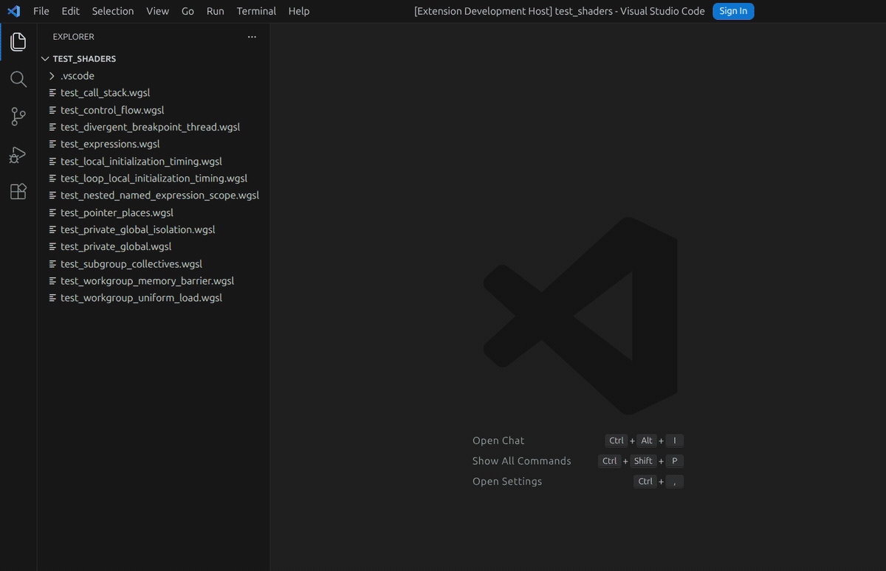

# WGSL Debugger

[](https://github.com/MatusT/malkovri/actions/workflows/build-vsix.yml)
[](https://nightly.link/MatusT/malkovri/workflows/build-vsix/main/malkovri-wgsl-debugger-vsix.zip)

A DAP (Debug Adapter Protocol) debugger for WGSL shaders, with a VS Code extension.

Simulates shader execution on the CPU using [naga](https://github.com/gfx-rs/naga) and exposes (so far) step-through, and variable inspection via the standard debug adapter protocol.



Supported:
- [x] Basic compute shaders
- [x] Basic buffer global inputs
- [x] Multiple compute invocations in one workgroup
- [x] `var<workgroup>` memory shared across workgroup invocations
- [x] Workgroup/storage/subgroup barrier scheduling
- [x] `workgroupUniformLoad`
- [x] Subgroup ballot, gather, and collective operations represented by Naga IR
- [x] All expressions

TODO:
- [ ] Atomics (`atomic`)
- [ ] Image stores and image atomics (`imageStore`, `imageAtomic`)
- [ ] Image and sampler inputs
- [ ] Support for graphics pipeline with vertex + fragment shaders
- [ ] ... and like a million things :-)

## Requirements

- [Rust](https://rustup.rs/) (edition 2024, stable toolchain)
- [wasm-pack](https://rustwasm.github.io/wasm-pack/) (for the WASM component)
- [Deno](https://deno.com/) (for the VS Code extension)
- VS Code

## Build

```sh
# Build the DAP server
cargo build --release -p malkovri_wgsl_debugger_dap

# Build the WASM component
wasm-pack build malkovri_wgsl_debugger_wasm --target web

# Build the VS Code extension
cd vscode_extension
deno task build
```

## Run / Install

1. Build both components above.
2. Open the **root** `malkovri_wgsl_debugger/` folder in VS Code.
3. Press **F5** to build and launch the Extension Development Host.
4. Open a `.wgsl` file and create a launch configuration in `.vscode/launch.json`:

```json
{
  "type": "wgsl",
  "request": "launch",
  "name": "Debug shader",
  "program": "${workspaceFolder}/shader.wgsl",
  "singleThreadExecution": false,
  "workgroupConfig": {
    "workgroupSize": [64, 1, 1],
    "workgroupId": [0, 0, 0],
    "subgroupSize": 32,
    "numWorkgroups": [1, 1, 1]
  },
  "bindings": {
    "0:0": {
      "inline": [1.0, 2.0, 3.0, 4.0]
    }
  }
}
```

5. Press **F5** to start debugging.

## Launch config options

| Field                  | Type                           | Default       | Description                                                                        |
|------------------------|--------------------------------|---------------|------------------------------------------------------------------------------------|
| `program`              | string                         | —             | Absolute path to the WGSL shader file.                                             |
| `stopOnEntry`          | boolean                        | `false`       | Stop at the entry point before running to breakpoints.                             |
| `singleThreadExecution` | boolean                       | `false`       | Step Over and Continue advance only the selected VS Code thread instead of the whole workgroup. |
| `workgroupConfig.workgroupSize` | `[u32, u32, u32]`     | `[1, 1, 1]`   | Number of threads along each dimension of the workgroup being debugged.            |
| `workgroupConfig.workgroupId`   | `[u32, u32, u32]`     | `[0, 0, 0]`   | Which workgroup in the dispatch to debug.                                           |
| `workgroupConfig.subgroupSize`  | number                | `4`           | Subgroup (warp) size. Must be a power of 2 in `[4, 128]` (WGSL spec). All thread IDs are derived from this and `workgroupSize`. |
| `workgroupConfig.numWorkgroups` | `[u32, u32, u32]`     | `[1, 1, 1]`   | Total number of workgroups in the dispatch (used for `@builtin(num_workgroups)`).  |
| `bindings`             | object                         | `{}`          | Resource bindings keyed by `"group:binding"` (e.g. `"0:0"`).                       |
| `bindings[].type`      | `"f32"` \| `"i32"` \| `"u32"` | `"f32"`       | Optional element type of the buffer.                                                |
| `bindings[].inline`    | array                          | —             | Inline array of values. Cannot be combined with `file`.                            |
| `bindings[].file`      | string                         | —             | Path to a data file relative to the shader. Cannot be combined with `inline`.      |
| `bindings[].fileContent` | string                       | —             | Inline file content; currently supports RON content.                               |
| `bindings[].format`    | `"ron"` \| `"binary"`          | `"ron"`       | File format: `"ron"` (RON array) or `"binary"` (little-endian 4-byte values).     |
