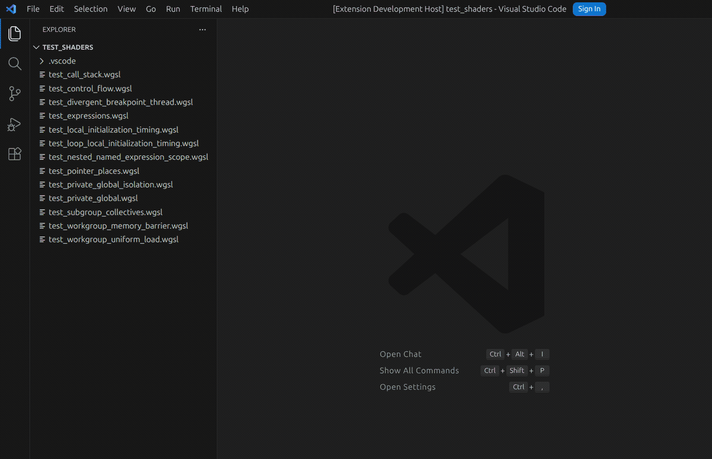

# WGSL Debugger

[](https://github.com/MatusT/malkovri/actions/workflows/build-vsix.yml)
[](https://nightly.link/MatusT/malkovri/workflows/build-vsix/main/malkovri-wgsl-debugger-vsix.zip)

A DAP (Debug Adapter Protocol) debugger for WGSL shaders, with a VS Code extension.

Simulates shader execution on the CPU using [naga](https://github.com/gfx-rs/naga) and exposes (so far) step-through, and variable inspection via the standard debug adapter protocol.



Supported:
- [x] Basic compute shaders
- [x] Basic buffer global inputs
- [x] Multiple compute invocations in one workgroup
- [x] `var<workgroup>` memory shared across workgroup invocations
- [x] Workgroup/storage/subgroup barrier scheduling
- [x] `workgroupUniformLoad`
- [x] Subgroup ballot, gather, and collective operations represented by Naga IR
- [x] Scalar/vector expressions (partial builtin coverage)

TODO:
- [ ] Atomics (`atomic`)
- [ ] Image stores and image atomics (`imageStore`, `imageAtomic`)
- [ ] Image and sampler inputs
- [ ] Support for graphics pipeline with vertex + fragment shaders
- [ ] ... and like a million things :-)

## Requirements

- [Rust](https://rustup.rs/) (edition 2024, stable toolchain)
- [wasm-pack](https://rustwasm.github.io/wasm-pack/) (for the WASM component)
- [Deno](https://deno.com/) (for the VS Code extension)
- VS Code

## Build

```sh
# Build the DAP server
cargo build --release -p malkovri_wgsl_debugger_dap

# Build the WASM component
wasm-pack build malkovri_wgsl_debugger_wasm --target web

# Build the VS Code extension
cd vscode_extension
deno task build
```

## Run / Install

1. Build both components above.
2. Open the **root** `malkovri_wgsl_debugger/` folder in VS Code.
3. Press **F5** to build and launch the Extension Development Host.
4. Open a `.wgsl` file and create a launch configuration in `.vscode/launch.json`:

```json
{
  "type": "wgsl",
  "request": "launch",
  "name": "Debug shader",
  "program": "${workspaceFolder}/shader.wgsl",
  "entryType": "compute",
  "entryPoint": "main",
  "singleThreadExecution": false,
  "workgroupConfig": {
    "workgroupSize": [64, 1, 1],
    "workgroupId": [0, 0, 0],
    "subgroupSize": 32,
    "numWorkgroups": [1, 1, 1]
  },
  "bindings": {
    "0:0": {
      "inline": [1.0, 2.0, 3.0, 4.0]
    }
  }
}
```

5. Press **F5** to start debugging.

Step Over executes called functions while still honoring breakpoints inside them. In
single-thread mode, Continue pauses when the selected invocation finishes or waits
for other invocations at a synchronization point. Resume the other invocations to
make progress past a barrier.

Long-running requests pause after a bounded amount of execution. Use Continue to
resume. Frame and variable references remain valid only while execution is stopped.

## Core API and code organization

`ShaderProgram::new` parses and validates WGSL once and returns an
`Arc<ShaderProgram>`. The program directly owns its source, Naga module, scope
metadata, and indexed blocks. Create independent debugger sessions through
`program.create_debugger(...)`; each session retains the shared program even if
the caller drops its handle.

```rust
use std::collections::HashMap;
use malkovri_wgsl_debugger::{GlobalConstants, ShaderProgram, WorkgroupConfig};

fn main() -> Result<(), Box<dyn std::error::Error>> {
    let program = ShaderProgram::new("@compute @workgroup_size(1) fn main() {}")?;
    let mut debugger = program.create_debugger(
        0, // index from program.entry_points()
        WorkgroupConfig::default(),
        GlobalConstants::default(),
        HashMap::new(), // ResourceBinding { group, binding } -> Value
    )?;
    let outcome = debugger.run_to_breakpoint(1, false, &[], None)?;
    println!("{outcome:?}");
    Ok(())
}
```

| Location | Responsibility |
| --- | --- |
| `malkovri_wgsl_debugger/src/program/` | Parsing, validation, scope analysis, and immutable executable blocks. |
| `malkovri_wgsl_debugger/src/invocation/` | One invocation's frames, expression cache, stage inputs, and memory access. |
| `malkovri_wgsl_debugger/src/debugger/` | Invocation scheduling, synchronization, inspection, and source-level execution control. |
| `malkovri_wgsl_debugger_dap/` | Launch input, DAP messages, and client frame/scope references. |
| `malkovri_wgsl_debugger_wasm/`, `vscode_extension/` | Browser bindings and VS Code integration. |

Frames store program/block identifiers and counters. Stepping borrows indexed
instructions; it does not clone statements or nested blocks. Function locals and
private globals belong to each invocation. Resource bindings and workgroup
variables share memory within a session. Reading a composite member borrows the
path and copies the selected value.

Program and execution state stay private. Simple configuration values and
inspection snapshots expose their fields; changing a snapshot cannot change the
running debugger. `WorkgroupConfig::new` validates its configuration, while
`ResourceBinding` reuses Naga's plain binding record.

`step_over` and `run_to_breakpoint` report a `RunResult` independently of DAP.
`step`, `step_thread`, and `step_all` remain available for lower-level execution.
The DAP adapter owns protocol references and invalidates them when execution
resumes. Breakpoint catch-up still uses a bounded source-line heuristic for
invocations on different control-flow paths.

Each session selects one entry point and carries inputs for that stage only.
Basic vertex and fragment entry points can run sequentially from the same program,
with their return values available through `entry_point_output()`. Full graphics
execution still needs explicit vertex/fragment inputs, `@location` value transfer,
and rasterization/interpolation. Those can be added around successive sessions
without combining both stages into an invocation's execution state.

The [fragment support plan](PLAN_GRAPHICS.md) covers shader-generated or manually
supplied vertex outputs, their interpolation at pixels, and internally generated
2×2 fragment quads for derivatives and texture sampling. A rectangular pixel range
limits fragment execution within the viewport. Its configuration examples describe
planned behavior.

## Tests

```sh
cargo test --workspace --all-targets
cargo fmt --all -- --check
cargo clippy --workspace --all-targets -- -D warnings
cargo check -p malkovri_wgsl_debugger_wasm --target wasm32-unknown-unknown

# After installing extension dependencies:
cd vscode_extension
deno check src/extension.ts build/build.ts
```

Core tests assert shader results directly. DAP tests cover inspection, stepping,
protocol errors, and binding validation. Native transport tests run the adapter in
a child process with a timeout, so a stalled shader cannot hang the test suite.

Binding input must contain valid values of the selected scalar type; invalid
elements and integer overflow are reported as errors. Binary data must contain a
whole number of four-byte elements.

## Launch config options

Select the shader stage with `entryType` (`compute`, `vertex`, or `fragment`)
and the WGSL function with `entryPoint`. Either can be omitted if the remaining
selection identifies exactly one entry point. With neither field, the shader must
have exactly one entry point. Ambiguous selections, unknown names, and stage/name
mismatches fail with a list of available entry points.

Compute shaders use `workgroupConfig`. Vertex shaders use `drawConfig`, which
emulates a non-indexed WebGPU `draw(vertexCount, instanceCount, firstVertex,
firstInstance)` call. The debugger creates `vertexCount * instanceCount` threads,
with distinct `vertex_index` and `instance_index` builtins, including the starting
offsets. Threads are listed by instance, then vertex. For example, this debugs
three vertices in each of two instances (six threads):

```json
{
  "entryType": "vertex",
  "entryPoint": "vs_main",
  "drawConfig": {
    "vertexCount": 3,
    "instanceCount": 2,
    "firstVertex": 0,
    "firstInstance": 0
  }
}
```

Omitting `drawConfig` defaults to one vertex and one instance. Debug sessions
require at least one invocation; zero counts and overflowing indices are rejected.
Indexed draws are not supported yet. Supplying either configuration for the wrong
shader stage is an error. In the Rust API, pass `DrawConfig` for vertex shaders,
`WorkgroupConfig` for compute shaders, or `ExecutionConfig::Fragment` for a single
fragment with default inputs to `ShaderProgram::create_debugger`.

| Field                  | Type                           | Default       | Description                                                                        |
|------------------------|--------------------------------|---------------|------------------------------------------------------------------------------------|
| `program`              | string                         | —             | Absolute path to the WGSL shader file.                                             |
| `entryType` | `"compute"` \| `"vertex"` \| `"fragment"` | inferred | Shader stage to debug. |
| `entryPoint` | string | inferred | WGSL entry point function name; selection must be unambiguous. |
| `stopOnEntry`          | boolean                        | `false`       | Stop at the entry point before running to breakpoints.                             |
| `singleThreadExecution` | boolean                       | `false`       | Step Over and Continue advance only the selected VS Code thread instead of all shader invocations. |
| `workgroupConfig.workgroupSize` | `[u32, u32, u32]`     | `[1, 1, 1]`   | Number of threads along each dimension of the workgroup being debugged.            |
| `workgroupConfig.workgroupId`   | `[u32, u32, u32]`     | `[0, 0, 0]`   | Which workgroup in the dispatch to debug.                                           |
| `workgroupConfig.subgroupSize`  | number                | `4`           | Subgroup (warp) size. Must be a power of 2 in `[4, 128]` (WGSL spec). All thread IDs are derived from this and `workgroupSize`. |
| `workgroupConfig.numWorkgroups` | `[u32, u32, u32]`     | `[1, 1, 1]`   | Total number of workgroups in the dispatch (used for `@builtin(num_workgroups)`).  |
| `drawConfig.vertexCount` | u32 | `1` | Vertices per instance (vertex shaders only; at least 1). |
| `drawConfig.instanceCount` | u32 | `1` | Instances to debug (at least 1). |
| `drawConfig.firstVertex` | u32 | `0` | First `@builtin(vertex_index)`. |
| `drawConfig.firstInstance` | u32 | `0` | First `@builtin(instance_index)`. |
| `bindings`             | object                         | `{}`          | Resource bindings keyed by `"group:binding"` (e.g. `"0:0"`).                       |
| `bindings[].type`      | `"f32"` \| `"i32"` \| `"u32"` | `"f32"`       | Optional element type of the buffer.                                                |
| `bindings[].inline`    | array                          | —             | Inline array of values. Cannot be combined with `file`.                            |
| `bindings[].file`      | string                         | —             | Path to a data file relative to the shader. Cannot be combined with `inline`.      |
| `bindings[].fileContent` | string                       | —             | Inline file content; currently supports RON content.                               |
| `bindings[].format`    | `"ron"` \| `"binary"`          | `"ron"`       | File format: `"ron"` (RON array) or `"binary"` (little-endian 4-byte values).     |

### Decoded vertex inputs (Rust)

Pass `VertexConfig { draw, attributes }` to `create_debugger` to supply
`@location` attributes. Each `VertexAttribute` contains typed `Value`s and a
`VertexStepMode::Vertex` or `Instance`. Stream lengths match the corresponding
draw count, and indexing starts at zero even with nonzero `firstVertex` or
`firstInstance`. Direct arguments and input structs use the same bindings.
`DrawConfig` alone remains supported for shaders with only builtin inputs.

In launch JSON, use `vertexAttributes` keyed by location, for example
`"vertexAttributes": { "0": { "values": [[0.0, 0.5], [0.5, -0.5]] } }`
with `drawConfig.vertexCount: 2`. `stepMode` defaults to `"vertex"`; use
`"instance"` for one value per instance. Numeric types come from the selected
entry's WGSL declarations. Missing inputs and malformed attributes fail launch.

### CPU pixel interpolation (Rust)

`ShaderProgram::interpolate_fragments` accepts a fragment entry, triangle-list
`graphics::VertexOutput` records, and `RasterConfig`. It returns 2×2 quads with
interpolated locations, fragment positions, geometric coverage, and selected output
masks. `PixelRange { from, to }` uses inclusive/exclusive framebuffer bounds without
changing the viewport. Outside-range lanes are generated only as helpers in needed
quads. The initial implementation supports center/flat interpolation, positive
clip W, and vertex depth in `[0, W]`; clipping and texture sampling are deferred.

`ExecutionConfig::FragmentQuads(quads)` executes generated pixel inputs, including
input structs and fragment builtins. `thread_fragment_info` identifies pixels and
helper/discard state. Helpers continue computing but never produce shader outputs
or write resource memory; `discard` also suppresses subsequent observable effects
when called from a nested function. Empty quad lists finish without invocations.

Fragment quads support `dpdx`, `dpdy`, and `fwidth` (fine and coarse variants).
Derivative expressions rendezvous across four lanes, including helpers, using
shader-computed operands. Missing/divergent participants produce an execution
error. Native and WASM builds use scalar `glam` double-precision vectors for
rasterization. Texture expressions currently report an explicit unsupported error;
texture bindings and sampling will be added later on this quad foundation.
